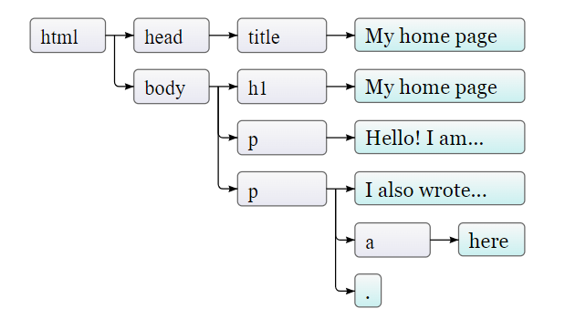
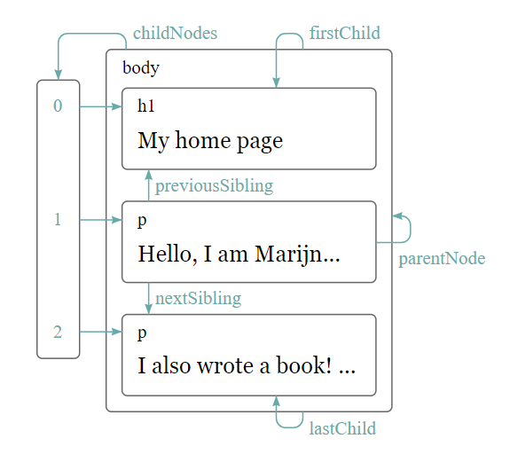

# [The Document Object Model](https://eloquentjavascript.net/14_dom.html)

The DOM acts as a live data structure.

* *Document Object Model*

```html
<!doctype html>
<html>
  <head>
    <title>My home page</title>
  </head>
  <body>
    <h1>My home page</h1>
    <p>Hello, I am Marijn and this is my home page.</p>
    <p>I also wrote a book! Read it
      <a href="http://eloquentjavascript.net">here</a>.</p>
  </body>
</html>
```

* global binding *document*
* *documentElement* property

## *Tree*

Each *node* may refer to other nodes, *children*, which in turn may have their own children.

We call a data structure a *tree* when it has a branching structure, has no cycles (a node may not contain itself, directly or indirectly), and has a single, well-defined *root*. In the case of the DOM, document.documentElement serves as the root.

* *leaves* nodes without children



## DOM

Nodes for *elements* represent HTML tags

* *nodeType* property [mdn](https://developer.mozilla.org/en-US/docs/Web/API/Node/nodeType)
* *childNodes* propery
* *NodeList*



* *parentNode*
* *childNodes*
* *children*
* *firstChild* | *lastChild* properties
* *previousSibling* | *nextibling* properties

The following function scans a document for text nodes containing a given string and returns true when it has found one:

```js
function talksAbout(node, string) {
  if (node.nodeType == Node.ELEMENT_NODE) {
    for (let child of node.childNodes) {
      if (talksAbout(child, string)) {
        return true;
      }
    }
    return false;
  } else if (node.nodeType == Node.TEXT_NODE) {
    return node.nodeValue.indexOf(string) > -1;
  }
}

console.log(talksAbout(document.body, "book"));
// → true
The nodeValue property of a text node holds the string of text that it represents.
```

### Finding Elements

 ```js
let link = document.body.getElementsByTagName("a")[0];
console.log(link.href);
 ```

* *document.getElementById*

```html
<p>My ostrich Gertrude:</p>
<p></p>

<script>
  let ostrich = document.getElementById("gertrude");
  console.log(ostrich.src);
</script>
```

* *getElementsByClassName*
* *getElementsByTagName*
  * retuens a *live* node list
  * *solid* collection of nodes

  ```js
  // Array.from
  let arrayish = {0: "one", 1: "two", length: 2};
  let array = Array.from(arrayish);
  console.log(array.map(s => s.toUpperCase()));
  // → ["ONE", "TWO"]
  ```
  
* *appendChild*
* *insertBefore*

```html
<p>One</p>
<p>Two</p>
<p>Three</p>

<script>
  let paragraphs = document.body.getElementsByTagName("p");
  document.body.insertBefore(paragraphs[2], paragraphs[0]);
</script>
```

* *replaceChild*

### Creating Nodes

```html
<p>The  in the
  .</p>

<p><button onclick="replaceImages()">Replace</button></p>

<script>
  function replaceImages() {
    let images = document.body.getElementsByTagName("img");
    for (let i = images.length - 1; i >= 0; i--) {
      let image = images[i];
      if (image.alt) {
        let text = document.createTextNode(image.alt);
        image.parentNode.replaceChild(text, image);
      }
    }
  }
</script>
```

#### [see in browser](./example.php#create_node)

### Attributes

* *data-*
* *getAttribute*
* *setAttribute*

```html
<p data-classified="secret">The launch code is 00000000.</p>
<p data-classified="unclassified">I have two feet.</p>

<script>
  let paras = document.body.getElementsByTagName("p");
  for (let para of Array.from(paras)) {
    if (para.getAttribute("data-classified") == "secret") {
      para.remove();
    }
  }
</script>
```

#### [see in browser](./example.php#attributes)

### Layout

* *block* elements
* *inline* elements

* *offsetWidth* | *offsetHeight* [mdn](https://developer.mozilla.org/en-US/docs/Web/API/HTMLElement/offsetHeight)
  * gives space of element in *pixels*
* *clientWidth* | *clientHeight
  * gives the size of space *inside* the element (ignoring border with)

* *getBoundingCLientRect*
  * returns *top*, *bottom*, *letf*, and *right* properites
  * positions of the sides relative to the top lef of screen
* *pageXOffset* | *pageYOffset*

 When a program asks for the position or size of something by reading properties such as offsetHeight or calling getBoundingClientRect, providing correct information requires computing a layout.

A program that repeatedly alternates between reading DOM layout information and changing the DOM forces a lot of layout computations to happen and will consequently run very slowly.

```html
<p><span id="one"></span></p>
<p><span id="two"></span></p>

<script>
  function time(name, action) {
    let start = Date.now(); // Current time in milliseconds
    action();
    console.log(name, "took", Date.now() - start, "ms");
  }

  time("naive", () => {
    let target = document.getElementById("one");
    while (target.offsetWidth < 2000) {
      target.appendChild(document.createTextNode("X"));
    }
  });
  // → naive took 32 ms

  time("clever", function() {
    let target = document.getElementById("two");
    target.appendChild(document.createTextNode("XXXXX"));
    let total = Math.ceil(2000 / (target.offsetWidth / 5));
    target.firstChild.nodeValue = "X".repeat(total);
  });
  // → clever took 1 ms
</script>
```

#### [see in browser](./example.php#layout)

### Styling

* A *Style* attribute may contain one or more *declarations*

```html
<p><a id="link" href="." style="color: green; border: none;">Green link</a></p>
<script>
  document.getElementById("link").style.color = "magenta";
  document.getElementById("link").style["font-family"] = "mono";
  document.getElementById("link").style.fontFamilty = "mono";
</script>
```

### Cascading Styles

* *Cascading Style Sheets (CSS)*
* *style sheet*: set of rulles for how to style elements in a document.
  * most recently read rule get a higher precedence
  * if rules have the same *specificity*

### Query Selector
